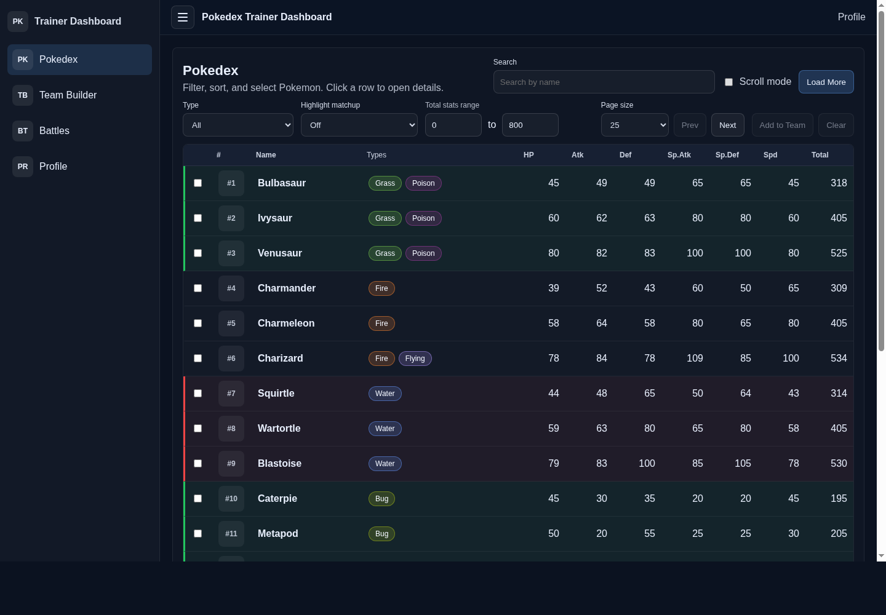
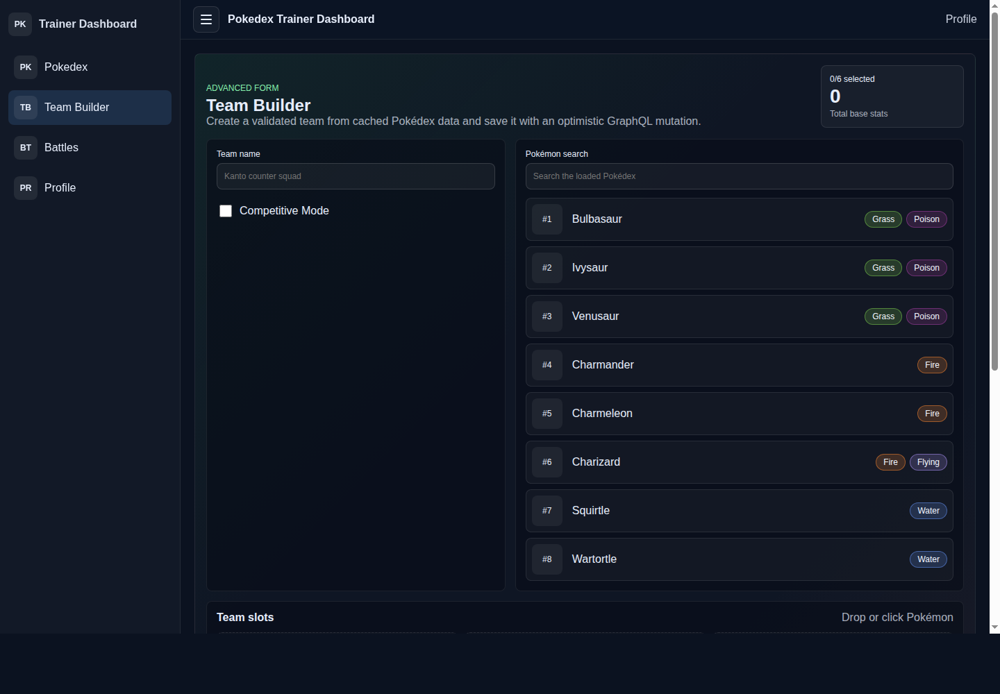
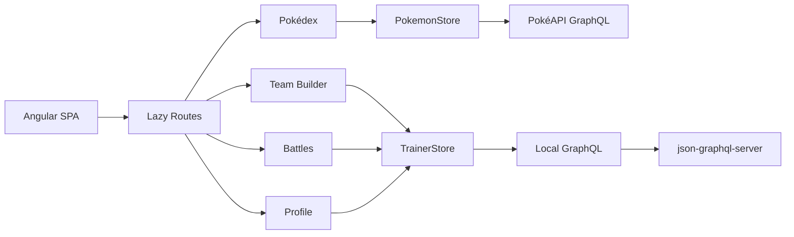

# Pokédex Trainer Dashboard

Angular 19 single-page dashboard for browsing Pokémon, building trainer teams, logging battles, and managing trainer profiles with GraphQL.

Detailed client requirement mapping is in [QA.txt](QA.txt).

## Features

- Pokédex table with search, type/stat filters, sorting, pagination, multi-select, and Add to Team flow.
- Pokémon detail drawer with stats radar chart, evolution/moves data, YouTube video embed, and cry audio.
- Team Builder with reactive forms, async unique-name validation, dynamic member fields, Competitive Mode EV validation, and CDK drag/drop.
- Battle dashboard with battle logging, monthly win/loss chart, history table, and simulated live battle feed.
- Trainer Profile page with trainer switching, editable profile form, persisted selected trainer, and summary stats.
- Custom RxJS stores using `BehaviorSubject`, selectors, optimistic updates, retry/error handling, and cleanup.
- Angular Signals for UI state, derived values, persistence effects, and route/detail state.

## Tech Stack

- Angular 19 standalone components
- Apollo Angular + GraphQL
- RxJS
- Angular Signals
- Chart.js / ng2-charts
- Angular CDK drag/drop
- json-graphql-server
- Karma/Jasmine unit tests

## Screenshots

### Pokédex



### Team Builder



## Setup

Install dependencies:

```bash
npm install
```

Start the local GraphQL mock server:

```bash
npm run local:graphql
```

In another terminal, start the Angular dev server:

```bash
npm start
```

Open:

```text
http://localhost:4200/
```

## Low-Resource Run Mode

For slower machines, use the production build and static server instead of `ng serve`.

Terminal 1:

```bash
npm run local:graphql
```

Terminal 2:

```bash
npm run build:prod
npm run serve:dist
```

Open:

```text
http://localhost:4200/pokedex
```

If you rebuild while `serve:dist` is already running, restart `serve:dist` so it picks up Angular's new hashed JavaScript filenames.

## Scripts

| Script | Description |
| --- | --- |
| `npm run local:graphql` | Starts `json-graphql-server db.js --port 4100` |
| `npm run local:graphql:4000` | Starts the mock server on port `4000` |
| `npm start` | Starts Angular dev server |
| `npm run build:prod` | Builds the production app |
| `npm run serve:dist` | Serves the production build on port `4200` |
| `npm test` | Runs unit tests |

## GraphQL Endpoints

Public Pokémon API:

```text
https://beta.pokeapi.co/graphql/v1beta
```

Local mock API:

```text
http://localhost:4100/graphql
```

The original brief used port `4000`, but this repo defaults to `4100` to avoid local port conflicts.

## Architecture



## Project Structure

```text
src/app/
  api/          GraphQL API services and models
  features/     Route components
  graphql/      Apollo clients and endpoint config
  shared/       Shared UI/services/directives
  state/        RxJS stores and selectors
```

## Testing

Run the unit tests:

```bash
npm test
```

In this container environment:

```bash
CHROME_BIN=/snap/bin/chromium npm test -- --watch=false --browsers=ChromeHeadless
```

Current coverage includes:

- Store method
- Selector
- Component signal
- Form validators
- Utility functions

## Verification

Latest local verification:

```text
npm run build:prod
PASS

CHROME_BIN=/snap/bin/chromium npm test -- --watch=false --browsers=ChromeHeadless
9 SUCCESS
```

Headless browser acceptance QA also passed:

```text
26/26 checks passed
```

## Bonus Work

- CDK drag-and-drop Team Builder.
- Signal-based type highlight directive.
- Micro-interactions, loading states, hover states, validation/status banners, and animated charts.

See [QA.txt](QA.txt) for the detailed requirement-by-requirement notes.

## Troubleshooting

### Blank page after rebuilding

Restart the static server:

```bash
Ctrl+C
npm run serve:dist
```

### Local GraphQL server is not responding

Check port `4100`:

```bash
ss -lptn 'sport = :4100'
```

Then restart:

```bash
npm run local:graphql
```

### Pulling on another device

```bash
git clone https://github.com/Technova-K02/pokedex-angular.git
cd pokedex-angular
npm install
npm run local:graphql
```

In a second terminal:

```bash
npm run build:prod
npm run serve:dist
```
